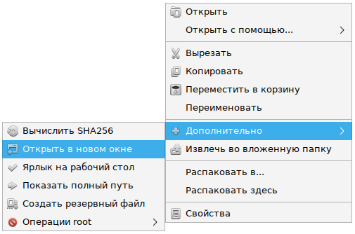

# Context menu for psmanfm-qt

**Source Code:** https://github.com/Koi-foo/pcmanfm-qt-context-menu

## Summary:
Action menu for pcmanfm-qt

## Description:
Context menu for psmanfm-qt
* Sha256 checksum calculation
* Opens a separate window at the specified location
* Create desktop shortcut
* Create backup file
* Search for files in the specified folder
* Show full path
* Open archive to subfolder

* Edit document as root
* Open terminal as root

## Requires:
* Requires: zenity
* Requires: coreutils
* Requires: xterm
* Requires: beesu

## Install
The release contains ready-made rpm packages for altlinux. On distributions that don't use rpm, you can install it manually.

Unpack the archive, copy the opt and usr folder to the **"/"** root, re-enter the session.

Beesu is used to get root, change this in **usr/share/file-manager/actions/root-open-document.desktop** and **usr/share/file-manager/actions/root-open-console.desktop**

Lxqt-archiver is used to unpack archives. You can replace with whatever you want in the file: **usr/share/file-manager/actions/open-archive-here.desktop**

To open the terminal, xterm is used, it can be replaced in the file: **usr/share/file-manager/actions/root-open-console.desktop**

We would be grateful for any suggestions for improvements or new items.

## Changelog
* New version v1.1 Release

## Preview

  

